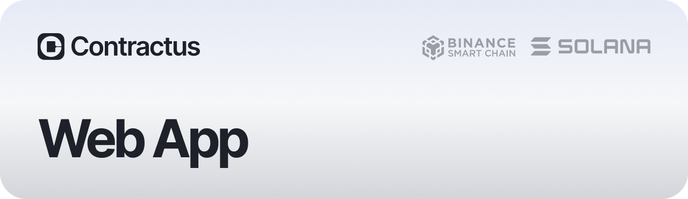

Penning and signing contracts involving considerable sums is a tedious and lengthy process. Contractus facilitates contract signing by vastly accelerating the process and cutting down associated costs.

 - [`WepApp`](http://app.contractus.tech/)
 - [`Website`](http://contractus.tech/)
 - [`AppStore`](https://apps.apple.com/us/app/contractus-safe-deals/id6462698654)
 - *GooglePlay (Soon)*

`This repository contains the source code of the WebApp.`

## Getting Started

Run the development server:

```bash
yarn
# then
yarn dev
```

## License

Contractus WebApp is available under the [MIT License][License].

